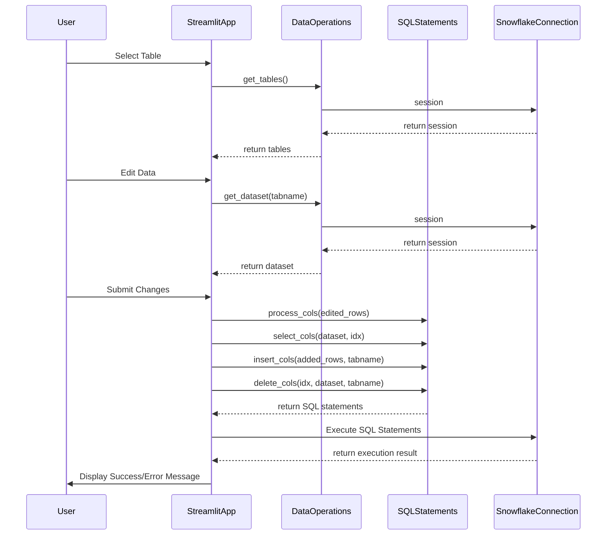
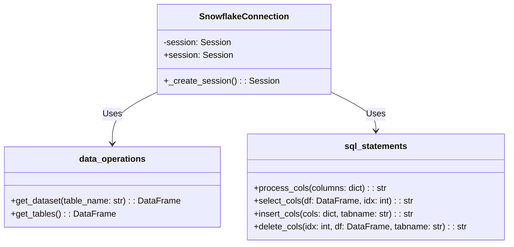

[](https://codecov.io/gh/arturogonzalezm/update_snowflake_tables_from_streamlit)
[](https://github.com/arturogonzalezm/update_snowflake_tables_from_streamlit/actions/workflows/workflow.yml)
[](https://opensource.org/licenses/MIT)

# StreamLit CRUD App

This project is a Streamlit application for editing Snowflake tables. The application allows users to select a table from Snowflake, edit the data, and apply changes (update, insert, delete) directly to the Snowflake database.

## Project Structure

```python
streamlit_crud/
│
├── app.py
├── backend/
│ ├── init.py
│ ├── data_operations.py
│ ├── snowflake_connection.py
│ └── sql_statements.py
├── tests/
│ ├── init.py
│ ├── test_data_operations.py
│ ├── test_snowflake_connection.py
│ └── test_sql_statements.py
```

## Sequence Diagram



### Files Description

- `main.py`: The main Streamlit application file that includes the UI for selecting and editing Snowflake tables.
- `backend/`: Directory containing the backend logic.
  - `__init__.py`: Indicates that the directory is a Python package.
  - `data_operations.py`: Functions for interacting with Snowflake tables (e.g., `get_dataset`, `get_tables`).
  - `snowflake_connection.py`: Singleton class for managing the Snowflake connection.
  - `sql_statements.py`: Functions for generating SQL statements (e.g., `process_cols`, `select_cols`, `insert_cols`, `delete_cols`).
- `tests/`: Directory containing the unit tests.
  - `__init__.py`: Indicates that the directory is a Python package.
  - `test_data_operations.py`: Unit tests for the `data_operations.py` module.
  - `test_snowflake_connection.py`: Unit tests for the `snowflake_connection.py` module.
  - `test_sql_statements.py`: Unit tests for the `sql_statements.py` module.

## Running the Application

To run the Streamlit application, execute the following command in your terminal:

```sh
streamlit run app.py
```

This will start the Streamlit server and open the application in your default web browser.

## Running the Tests

To run the unit tests, execute the following command in your terminal:

```sh
pytest
```

This will run all the tests in the `tests/` directory and display the results in the terminal.

## Class Diagram



## License

This project is licensed under the terms of the MIT license.
